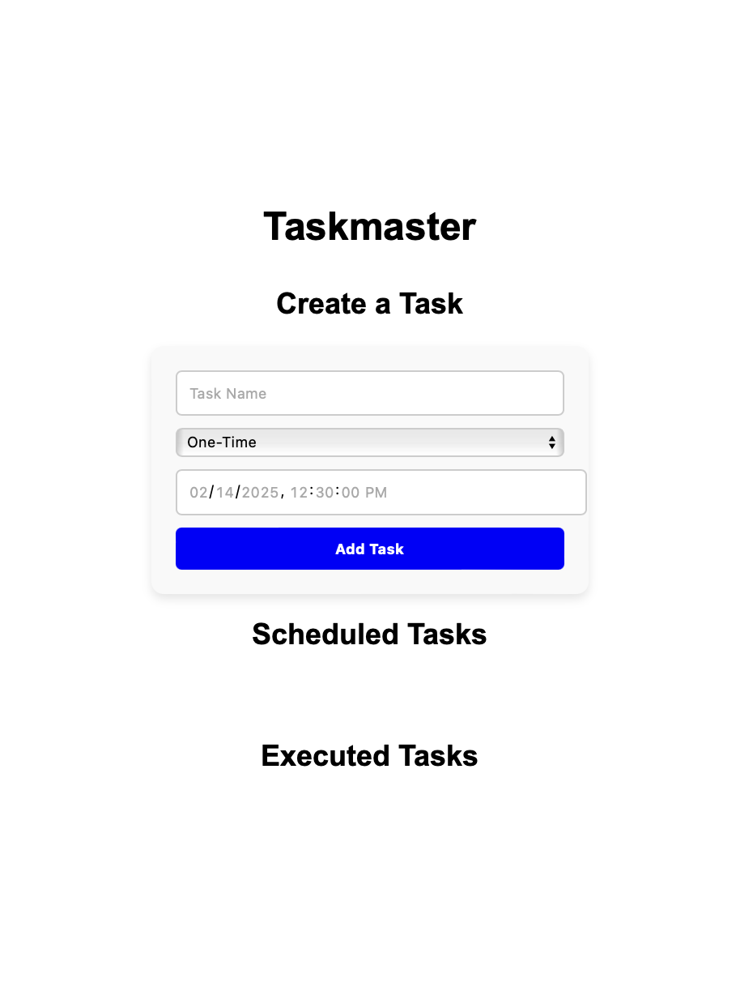

# Taskmaster - Distributed Task Scheduler  
 **React + TypeScript + Docker + PostgreSQL**

 <div align="center">
  
</div>


---

## **Overview**
Taskmaster is a **distributed task scheduler** that allows users to **create, schedule, and manage tasks** via a **React-based GUI**. Built with **TypeScript, PostgreSQL, and Docker**, The following work can be downloaded with the following link (https://drive.google.com/file/d/1-n8uanrGuML7TY0d2UwjwKEg5uIFrDUc/view?usp=sharing)

---

## **Key Features**
 **Task Registration** - Users can create tasks with execution times.  
**Task Execution** - Executes tasks **within 10 seconds** of their scheduled time.  
**Task Types**:
  - **One-time tasks** - Runs once at a specified time and is then removed.
  - **Recurring tasks** - Uses **Cron syntax** to define repeated execution schedules.  
  - **Task Logging** - Stores execution timestamps in a PostgreSQL database.  
  - **React GUI** - A clean user interface to create, view, and delete tasks.  
  - **Task Execution Simulation** - Instead of actually running code, **executions are logged** and displayed in the UI.  
  - **Dockerized Environment** - All components run within **Docker containers**, ensuring easy deployment.  

---

## 🏗 **Technology Stack**
| Component    | Technology |
|-------------|-----------|
| 🖥 **Frontend** | React + TypeScript |
| 🔙 **Backend** | Node.js + Express + TypeScript |
| 🗄 **Database** | PostgreSQL |
| 📦 **Containerization** | Docker + Docker Compose |
| 📅 **Task Scheduling** | Cron Syntax |

---

## **System Architecture**
1 **Frontend (React + TypeScript)**  
   - Users create and manage tasks.  
   - Displays scheduled and executed tasks in the UI.  

2 **Backend (Node.js + Express + TypeScript)**  
   - Handles task creation, execution, and logging.  
   - Executes tasks within 10 seconds of their scheduled time.  

3 **Database (PostgreSQL)**  
   - Stores scheduled tasks.  
   - Logs executed tasks.  

4 **Docker Containers**  
   - Backend, Frontend, and Database run in **isolated containers**.  
   - Ensures seamless deployment.  

---

## **Getting Started**

### 1 **Clone the Repository**
```sh
git clone https://github.com/your-username/taskmaster.git
cd taskmaster
```

### 2 **Start the Application using Docker Compose**
```sh
docker compose up --build
```
This command:
- Builds and starts **Frontend, Backend, and PostgreSQL Database**.
- The app will be available at `http://localhost:3000/`.
- The backend API will run at `http://localhost:4000/`.

---

## **Database Setup (PostgreSQL in Docker)**
We define two tables in PostgreSQL:

### 1 **Creating the `tasks` Table**
```sql
CREATE TABLE tasks (
    id SERIAL PRIMARY KEY,
    name VARCHAR(255) NOT NULL,
    type VARCHAR(50) CHECK (type IN ('One-Time', 'Recurring')) NOT NULL,
    cron_expression VARCHAR(255),
    scheduledtime TIMESTAMP WITH TIME ZONE,
    created_at TIMESTAMP DEFAULT CURRENT_TIMESTAMP
);
```
📌 This table **stores scheduled tasks**.

---

### 2 **Creating the `executed_tasks` Table**
```sql
CREATE TABLE executed_tasks (
    id SERIAL PRIMARY KEY,
    name VARCHAR(255) NOT NULL,
    type VARCHAR(50),
    cron_expression VARCHAR(255),
    executed_at TIMESTAMP DEFAULT CURRENT_TIMESTAMP
);
```
 This table **logs executed tasks**.

---

##  **Docker PostgreSQL: How to Create Tables Step-by-Step**
### Step 1: **Access the Database Container**
```sh
docker exec -it taskmaster-db psql -U postgres -d taskmaster
```

### Step 2: **Verify Connection**
```sql
\dt
```
This should display **existing tables**.

### Step 3: **Manually Create Tables**
```sql
-- Run these inside the PostgreSQL terminal
CREATE TABLE tasks (
    id SERIAL PRIMARY KEY,
    name VARCHAR(255) NOT NULL,
    type VARCHAR(50) CHECK (type IN ('One-Time', 'Recurring')) NOT NULL,
    cron_expression VARCHAR(255),
    scheduledtime TIMESTAMP WITH TIME ZONE,
    created_at TIMESTAMP DEFAULT CURRENT_TIMESTAMP
);
```

```sql
CREATE TABLE executed_tasks (
    id SERIAL PRIMARY KEY,
    name VARCHAR(255) NOT NULL,
    type VARCHAR(50),
    cron_expression VARCHAR(255),
    executed_at TIMESTAMP DEFAULT CURRENT_TIMESTAMP
);
```

### Step 4: **Verify Table Creation**
```sql
SELECT * FROM tasks;
SELECT * FROM executed_tasks;
```

---

## **API Endpoints**
### **Tasks (Scheduled)**
| Method | Endpoint         | Description |
|--------|-----------------|-------------|
| `GET`  | `/tasks`         | Fetch all scheduled tasks |
| `POST` | `/tasks`         | Create a new task |
| `PUT`  | `/tasks/:id`     | Update a scheduled task |
| `DELETE` | `/tasks/:id`   | Delete a task |

### **Executed Tasks**
| Method | Endpoint         | Description |
|--------|-----------------|-------------|
| `GET`  | `/executed-tasks` | Fetch all executed tasks |
| `DELETE` | `/executed-tasks/:id` | Delete an executed task |

---

## **Frontend (React UI)**
###  **Features**
- **Task Input Form** - Create both **One-Time** and **Recurring** tasks.
- **Cron Syntax Helper** - Displays cron examples for scheduling tasks.
- **Scheduled Tasks List**  - Shows tasks before execution.
- **Executed Tasks Log**  - Lists executed tasks with timestamps.
- **Edit Tasks** - Modify an existing scheduled task.
- **Delete Tasks** - Remove a scheduled or executed task.

---

## 🛠 **How Task Execution Works**
1 The system **executes tasks within 10 seconds** of their scheduled time.  
2 **One-Time Tasks** are **removed after execution** and logged in `executed_tasks`.  
3 **Recurring Tasks** follow **Cron Syntax** and **continue executing** until deleted.  
4 **Tasks are only logged**, not actually executed.  

---

## **License**
MIT License 

Note: Apply npm install for both client and server directories

---
